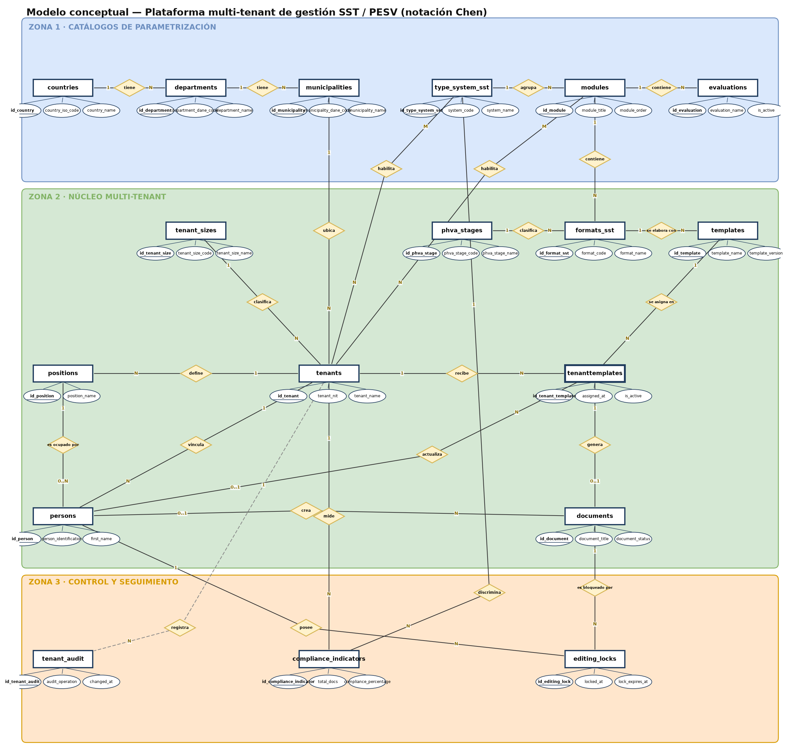
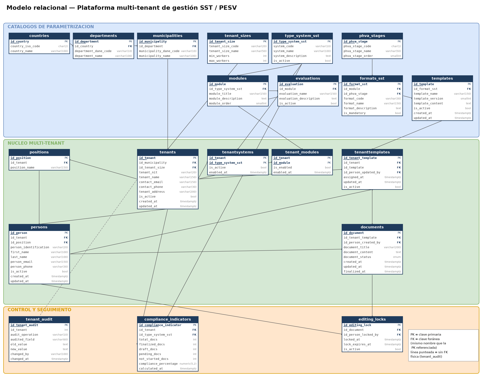

# Plataforma multi-tenant de gestión SST / PESV

Base de datos relacional en **PostgreSQL 16** para una plataforma que administra, de forma
centralizada y para múltiples empresas a la vez, la información de **Seguridad y Salud en el
Trabajo (SST)** y del **Plan Estratégico de Seguridad Vial (PESV)**.

## ¿Qué problema resuelve?

Una empresa de consultoría en SST/PESV atiende a muchos clientes distintos, y cada uno necesita
llevar su propio sistema de gestión —módulos habilitados, plantillas de documentos, avance de
cumplimiento— **sin ver ni mezclar la información de los demás**. Cuando esto se maneja con hojas
de cálculo o archivos sueltos por cliente aparecen los problemas de siempre: datos duplicados,
inconsistencias, pérdida de historial y ninguna forma confiable de saber qué tan al día está cada
empresa con sus documentos obligatorios.

Este proyecto resuelve eso con una arquitectura **multi-tenant**: los catálogos normativos
(sistemas, módulos, formatos, etapas del ciclo PHVA) se definen una sola vez y son compartidos,
pero todo lo operativo de cada empresa —personas, cargos, documentos generados, indicadores de
cumplimiento— queda aislado por empresa mediante el diseño de las tablas. El resultado es una
base de datos capaz de responder, con una sola consulta, preguntas como *"¿qué porcentaje de
documentos tiene finalizados cada empresa?"* o *"¿qué empresas todavía no han iniciado su plan de
seguridad vial?"*.

## Modelo de datos

### Modelo conceptual

Entidades del negocio, sus atributos principales y las relaciones entre ellas, en notación de
Chen (rectángulos = entidades, óvalos = atributos, rombos = relaciones).



Versión interactiva y editable: [`modelos/MODELO_CONCEPTUAL.drawio`](modelos/MODELO_CONCEPTUAL.drawio)
(se abre en [app.diagrams.net](https://app.diagrams.net)).

### Modelo relacional

Traducción del modelo conceptual a tablas, columnas, claves primarias y claves foráneas — el
mismo diseño que implementa `sql/01_schema.sql`.



## Diseño de la base de datos

- **20 tablas** organizadas en tres grupos: catálogos compartidos (países, sistemas de gestión,
  módulos, formatos, plantillas...), el núcleo multi-tenant (empresas, personas, cargos,
  documentos) y control/seguimiento (bloqueos de edición, auditoría, indicadores de cumplimiento).
- **Normalizado hasta cuarta forma normal (4FN)** — el razonamiento completo, forma por forma,
  está documentado en [`docs/01_normalizacion_4FN.md`](docs/01_normalizacion_4FN.md).
- **Convención de nombres consistente**: toda clave primaria se llama `id_<entidad>` y toda clave
  foránea conserva el mismo nombre que la clave primaria que referencia (por ejemplo,
  `persons.id_tenant` apunta a `tenants.id_tenant`), lo que permite escribir `JOIN ... USING
  (id_tenant)` en cualquier consulta sin necesidad de alias.
- **Reglas de negocio garantizadas por el propio esquema** (no solo por triggers): un solo
  bloqueo de edición activo por documento, una sola plantilla activa por formato, porcentajes de
  cumplimiento siempre entre 0 y 100, cargos que solo pueden pertenecer a la empresa de la
  persona que los ocupa, entre otras. Detalle completo en
  [`docs/03_modelo_fisico.md`](docs/03_modelo_fisico.md).
- **Vistas y vistas materializadas** para los reportes de seguimiento más frecuentes (personas
  por empresa, geografía, módulos habilitados, resumen de cumplimiento documental por sistema).
  Ver [`docs/04_vistas.md`](docs/04_vistas.md).

## Cómo levantar el entorno con Docker

El repositorio incluye un `docker-compose.yml` propio: no hace falta tener PostgreSQL instalado,
solo Docker.

```bash
# 1. Levantar PostgreSQL 16 y pgAdmin en segundo plano
docker compose up -d

# 2. Confirmar que el contenedor de la base de datos está saludable
docker ps
```

Esto crea dos contenedores:

| Contenedor | Qué es | Cómo se accede |
|---|---|---|
| `sst_pesv_db` | PostgreSQL 16 con la base `examen` ya creada | `localhost:5434`, usuario `sst_admin`, contraseña `sst_admin` |
| `sst_pesv_pgadmin` | pgAdmin (interfaz web para administrar la base) | [http://localhost:8090](http://localhost:8090), usuario `admin@example.com`, contraseña `admin` |

### Cargar el esquema y los datos de prueba

Todo el montaje (tablas, restricciones, índices, datos de ejemplo y vistas) vive en **un solo
archivo**, pensado para pegarse completo en el *Query Tool* de pgAdmin o ejecutarse por terminal:

```bash
docker exec -i sst_pesv_db psql -U sst_admin -d examen -f sql/00_examen_completo.sql
```

El script es idempotente: empieza limpiando cualquier objeto previo, así que se puede volver a
ejecutar completo las veces que haga falta sin que falle por "ya existe". Al terminar imprime un
resumen (conteo de filas por tabla y una muestra de las vistas) para confirmar que todo cargó
bien.

### Apagar el entorno

```bash
docker compose down          # detiene y elimina los contenedores
docker compose down -v       # además borra los datos guardados
```

> **Nota:** si vas a montar esta base en un equipo de un tercero (por ejemplo, para una
> sustentación) donde no tengas Docker propio ni permisos para crear bases de datos nuevas, en
> [`docs/05_dia_del_examen.md`](docs/05_dia_del_examen.md) está el flujo alternativo: cómo
> conectar pgAdmin y la terminal a un PostgreSQL que ya te hayan entregado, usando el mismo
> archivo `sql/00_examen_completo.sql` directamente sobre esa base.

## Estructura del repositorio

```text
examen-sst-pesv/
├── docker-compose.yml           PostgreSQL 16 + pgAdmin, listos para levantar
├── docs/
│   ├── 01_normalizacion_4FN.md  Análisis del enunciado y normalización 1FN → 4FN
│   ├── 02_modelo_conceptual.md  Especificación del modelo conceptual (notación Chen)
│   ├── 03_modelo_fisico.md      Traducción a tablas, restricciones e índices
│   ├── 04_vistas.md             Vistas y vistas materializadas
│   ├── 05_dia_del_examen.md     Cómo conectar pgAdmin/terminal a un PostgreSQL ya entregado
│   └── 06_repaso_consultas_basicas.md  Repaso teórico de SELECT/WHERE/JOIN/etc.
├── modelos/
│   ├── MODELO_CONCEPTUAL.drawio Modelo conceptual editable (app.diagrams.net)
│   ├── conceptual.png           Modelo conceptual exportado
│   └── relacional.png           Modelo relacional exportado
└── sql/
    ├── 00_examen_completo.sql   Archivo único: esquema + datos + vistas (idempotente)
    ├── 00_reset.sql             Limpieza idempotente (parte del archivo único)
    ├── 01_schema.sql            Tablas, restricciones e índices
    ├── 02_seed.sql              Datos de prueba: 4 empresas, catálogos completos
    ├── 03_vistas.sql            Vistas y vistas materializadas
    ├── 07_consultas_basicas.sql       Consultas con SELECT/WHERE/ORDER BY/LIKE/IN/BETWEEN
    ├── 08_consultas_intermedias.sql   Consultas con JOIN, GROUP BY, HAVING
    ├── 09_consultas_avanzadas.sql     Subconsultas, CTE, funciones de ventana
    └── 10_consultas_vistas.sql        Consultas apoyadas en las vistas materializadas
```

## Consultas SQL

Las consultas están organizadas por nivel de complejidad, cada una probada contra los datos de
prueba incluidos:

| Nivel | Archivo | Contenido |
|---|---|---|
| Básicas | [`sql/07_consultas_basicas.sql`](sql/07_consultas_basicas.sql) | `SELECT`, `WHERE`, `ORDER BY`, `DISTINCT`, `LIKE`, `IN`, `BETWEEN`, `IS NULL` — sin `JOIN` |
| Intermedias | [`sql/08_consultas_intermedias.sql`](sql/08_consultas_intermedias.sql) | `INNER JOIN`, `LEFT JOIN`, funciones de agregación, `GROUP BY`, `HAVING` |
| Avanzadas | [`sql/09_consultas_avanzadas.sql`](sql/09_consultas_avanzadas.sql) | Subconsultas, CTE, funciones de ventana (`RANK`, `ROW_NUMBER`, `SUM() OVER`), agregación condicional |
| Vistas | [`sql/10_consultas_vistas.sql`](sql/10_consultas_vistas.sql) | Consultas apoyadas en las vistas y vistas materializadas, incluido `REFRESH MATERIALIZED VIEW` |

## Datos de prueba

`02_seed.sql` carga un escenario realista con 4 empresas colombianas de distintos tamaños y
sectores (una constructora, una transportadora, una textilera y una empresa de logística —esta
última inactiva a propósito), sus catálogos completos de sistemas SST/PESV, módulos, formatos y
plantillas, y documentos en distintos estados (finalizado, en borrador, pendiente y sin iniciar)
para que las consultas de seguimiento y cumplimiento tengan resultados reales que mostrar.

## Alcance actual

Implementado: modelo conceptual, modelo relacional, modelo físico, datos de prueba, vistas y
vistas materializadas, y las baterías de consultas básicas, intermedias, avanzadas y orientadas a
vistas. Pendiente: procedimientos almacenados, funciones y triggers.

## Tecnologías

- PostgreSQL 16
- Docker / Docker Compose
- pgAdmin 4
- draw.io (modelo conceptual)
