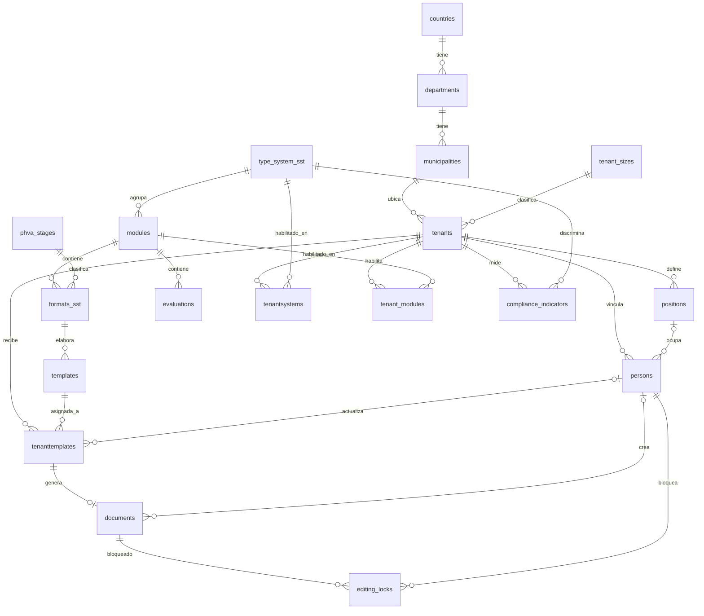

# Examen SST/PESV — Paso 1: Análisis del enunciado y normalización hasta 4FN

Este documento es el **primer entregable** del proyecto. Su objetivo es responder, con trazabilidad
al enunciado (`documentacion/Examen.md`), tres preguntas:

1. ¿Qué entidades exige el enunciado (con nombre fijo o sin él)?
2. ¿Por qué el modelo final tiene **exactamente estas tablas**, ni más ni menos?
3. ¿Cómo se llega a ellas aplicando 1FN → 2FN → 3FN → FNBC → 4FN?

Todo lo que se decide aquí es el insumo directo de los tres modelos siguientes:

| Paso | Modelo     | Herramienta            | Insumo de este documento                        |
|------|------------|------------------------|-------------------------------------------------|
| 2    | Conceptual | Excalidraw             | Secciones 8 y 10 (entidades y relaciones)       |
| 3    | Relacional | dbdiagram.io / draw.io | Sección 9 (diccionario de datos)                |
| 4    | Físico     | SQL (PostgreSQL 16)    | Secciones 9 y 12 (tipos, restricciones, reglas) |

**Notación usada**

| Símbolo | Significado |
|---------|-------------|
| `A → B` | Dependencia funcional: conocido A, B queda determinado. |
| `A ↠ B` | Dependencia multivaluada: para cada A hay un *conjunto* de B independiente del resto de columnas. |
| `*col`  | Columna que forma parte de la clave primaria. |
| `{...}` | Grupo repetitivo (varios valores en una misma "celda"). |

---

## 1. Levantamiento de requerimientos

### 1.1 Tablas cuyo nombre fija el enunciado

Estos nombres **no se pueden cambiar** porque las consultas del examen los referencian textualmente.

| Tabla                | Dónde aparece en el enunciado                               | Rol                                        |
|----------------------|-------------------------------------------------------------|--------------------------------------------|
| `tenants`            | Básicas 1, 2, 10, 11, 12; Intermedia 16; Triggers 1, 8      | Empresa / organización (el *tenant*)       |
| `persons`            | Básicas 3, 4, 10; Intermedias 1, 16; Trigger 2              | Personas o usuarios vinculados a un tenant |
| `positions`          | Básica 9; Intermedias 2, 20; Trigger 6                      | Cargos                                     |
| `tenant_sizes`       | Básica 13; Intermedia 3                                     | Catálogo de tamaños de empresa             |
| `countries`          | Básica 6; Intermedia 4                                      | Países                                     |
| `type_system_sst`    | Básica 14; Intermedias 9, 10                                | Tipos de sistema (SST, PESV)               |
| `tenant_modules`     | Intermedias 7, 8; Procedimientos 4, 9, 10                   | Módulos habilitados por tenant             |
| `tenantsystems`      | Intermedia 9; Procedimiento 5                               | Sistemas habilitados por tenant            |
| `formats_sst`        | Intermedias 11, 12                                          | Formatos asociados a módulos               |
| `tenanttemplates`    | Intermedias 13, 14, 15; Procedimientos 6, 15; Triggers 5, 7 | Plantillas asignadas a un tenant           |
| `editing_locks`      | Trigger 15                                                  | Bloqueos de edición                        |
| `vm_template_sst_docs_summary`, `vm_template_pesv_docs_summary` | Avanzadas 10, 22 | Vistas materializadas (no son tablas) |
| `vw_tenant_persons`  | Vistas 1                                                    | Vista (no es tabla)                        |

### 1.2 Entidades exigidas sin nombre de tabla

El alcance (sección 5 del enunciado) y las consultas obligan a que existan, aunque no las nombren.
El nombre propuesto sigue la convención del enunciado (inglés, `snake_case`).

| Componente / evidencia                                                                                   | Tabla propuesta         |
|----------------------------------------------------------------------------------------------------------|-------------------------|
| "departamentos o regiones pertenecientes a un país" (Básica 7)                                           | `departments`           |
| "municipios o ciudades correspondientes a un departamento" (Básica 8)                                    | `municipalities`        |
| "Módulos … título, descripción y orden de presentación" (Básica 15)                                      | `modules`               |
| "Etapas PHVA" (alcance); pivote P/H/V/A (Avanzada 7)                                                     | `phva_stages`           |
| "Plantillas: gestionar documentos base" (alcance); `tenanttemplates` necesita algo que asignar           | `templates`             |
| "Evaluaciones: registrar instrumentos o plantillas de evaluación" (alcance)                              | `evaluations`           |
| "Documentos generados"; documentos finalizados / borrador / no iniciados / pendientes (Avanzadas 10, 23) | `documents`             |
| "tabla de auditoría" con valor anterior y nuevo (Triggers 12, 13)                                        | `tenant_audit`          |
| "Indicadores: determinar nivel de avance"; trigger que valida 0–100 % (Trigger 11)                       | `compliance_indicators` |

### 1.3 Reglas de negocio extraídas del enunciado

Estas reglas condicionan la estructura (claves, FKs) o se implementarán después con triggers:

| #   | Regla | Fuente |
|-----|-------|--------|
| R1  | Cada empresa se identifica de forma única por sus "datos de identificación" (NIT). | Proc. 1 |
| R2  | Una persona pertenece a **una sola** empresa y puede trasladarse a otra. | Básica 10, Proc. 8 |
| R3  | Un cargo pertenece a una empresa; una persona solo puede ocupar cargos de su empresa. | Inter. 20, Trigger 6 |
| R4  | Un módulo pertenece a un único sistema (SST o PESV). | Inter. 10 |
| R5  | Un formato pertenece a un único módulo. | Inter. 11 |
| R6  | Una plantilla asignada a una empresa "indica" sistema, etapa PHVA y formato. | Inter. 14, Proc. 6 |
| R7  | Una empresa no puede tener el mismo módulo asignado dos veces. | Proc. 4, Trigger 4 |
| R8  | No se registran personas ni se asignan plantillas a empresas inactivas. | Triggers 3, 5 |
| R9  | No se elimina una empresa con personas, ni un sistema/módulo en uso. | Triggers 8, 9, 10 |
| R10 | El porcentaje de cumplimiento está entre 0 y 100. | Trigger 11 |
| R11 | Toda modificación de una empresa y de una plantilla asignada queda auditada (fecha, usuario, antes/después). | Triggers 7, 12, 13, 14 |
| R12 | Un recurso no puede ser editado por dos personas a la vez; los bloqueos vencen. | Obj. 16, Trigger 15 |
| R13 | Los datos de una empresa están lógicamente aislados de los de las demás (*multi-tenant*). | Planteamiento |

---

## 2. Punto de partida: la relación no normalizada (0FN)

Para normalizar hay que partir de cómo se vería la información **si se guardara en una sola hoja de
cálculo por empresa**, que es exactamente el escenario que el enunciado quiere evitar ("archivos
independientes, hojas de cálculo o documentos dispersos"). Esa "ficha de empresa" sería:

```text
FICHA_EMPRESA (
    nit, nombre, email_contacto, telefono, activa, fecha_registro,
    tamano, min_trabajadores, max_trabajadores,
    ciudad, departamento, pais,
    {sistemas_habilitados},                   -- "SST, PESV"
    {modulos_habilitados:  titulo, descripcion, orden, sistema},
    {personas:             identificacion, nombres, apellidos, email, cargo, activa},
    {plantillas_asignadas: nombre_plantilla, version, formato, modulo, etapa_phva, sistema,
                           estado_documento, contenido, fecha_actualizacion, usuario_actualiza},
    {bloqueos:             documento, bloqueado_por, fecha_bloqueo, vence},
    cumplimiento_sst, cumplimiento_pesv
)
```

Problemas concretos de esta estructura (son los que cada forma normal irá eliminando):

| Problema | Ejemplo en el dominio |
|----------|-----------------------|
| Valores no atómicos | `sistemas_habilitados = "SST, PESV"` no se puede filtrar con `WHERE`. |
| Grupos repetitivos sin límite | Una empresa con 300 personas necesita 300 "sub‑filas". |
| Redundancia | La descripción del módulo "Política SST" se copia en cada empresa que lo habilita. |
| Anomalía de actualización | Renombrar una etapa PHVA implica tocar todas las plantillas de todas las empresas. |
| Anomalía de inserción | No se puede registrar un módulo nuevo hasta que alguna empresa lo habilite. |
| Anomalía de borrado | Si se elimina la única empresa de un municipio, desaparece el municipio. |
| Datos derivados almacenados | `cumplimiento_sst` se desactualiza en cuanto cambia el estado de un documento. |

---

## 3. Primera forma normal (1FN)

**Regla:** todos los atributos son atómicos, no hay grupos repetitivos y cada fila se identifica
por una clave.

**Aplicación:** cada grupo repetitivo se convierte en una tabla propia que arrastra la clave de la
empresa (`nit`) más su propio identificador.

```text
EMPRESA           (*nit, nombre, email_contacto, telefono, activa, fecha_registro,
                   tamano, min_trabajadores, max_trabajadores, ciudad, departamento, pais,
                   cumplimiento_sst, cumplimiento_pesv)

EMPRESA_SISTEMA   (*nit, *sistema_codigo, sistema_nombre, sistema_descripcion, activo, fecha_habilitado)

EMPRESA_MODULO    (*nit, *modulo_titulo, modulo_descripcion, orden, sistema_codigo, habilitado, fecha)

EMPRESA_PERSONA   (*nit, *identificacion, nombres, apellidos, email, telefono, cargo, activa)

EMPRESA_PLANTILLA (*nit, *plantilla_codigo, plantilla_nombre, version,
                   formato_codigo, formato_nombre, modulo_titulo, etapa_phva, sistema_codigo,
                   estado_documento, contenido, fecha_actualizacion, usuario_actualiza)

BLOQUEO           (*nit, *plantilla_codigo, *fecha_bloqueo, bloqueado_por, vence, activo)
```

**Qué se ganó:** ya se puede consultar con SQL (cada dato en su celda, cada hecho en su fila).

**Qué sigue mal:** `modulo_descripcion`, `sistema_nombre`, `formato_nombre`, `etapa_phva`… se repiten
en cada empresa. Si 50 empresas habilitan el módulo "Comité de seguridad vial", su descripción está
50 veces.

---

## 4. Segunda forma normal (2FN)

**Regla:** estar en 1FN y que ningún atributo no clave dependa de **una parte** de la clave
primaria (solo aplica a tablas con clave compuesta).

**Análisis de dependencias parciales:**

| Tabla 1FN | Clave | Dependencia parcial detectada |
|-----------|-------|-------------------------------|
| `EMPRESA_SISTEMA`   | (nit, sistema_codigo)   | `sistema_codigo → sistema_nombre, sistema_descripcion` |
| `EMPRESA_MODULO`    | (nit, modulo_titulo)    | `modulo_titulo → modulo_descripcion, orden, sistema_codigo` |
| `EMPRESA_PLANTILLA` | (nit, plantilla_codigo) | `plantilla_codigo → plantilla_nombre, version, formato_codigo, formato_nombre, modulo_titulo, etapa_phva, sistema_codigo` |
| `EMPRESA_PERSONA`   | (nit, identificacion)   | Ninguna: en este dominio la persona **se registra dentro de** una empresa (R2), así que sus datos dependen de la clave completa. |
| `EMPRESA`           | (nit)                   | No aplica (clave simple). |

**Descomposición:** lo que depende solo de la parte "catálogo" de la clave sale a su propia tabla,
y la tabla de relación se queda únicamente con los atributos **del vínculo** (fecha, activo…).

```text
SISTEMA           (*sistema_codigo, nombre, descripcion)
EMPRESA_SISTEMA   (*nit, *sistema_codigo, activo, fecha_habilitado)

MODULO            (*modulo_titulo, descripcion, orden, sistema_codigo)
EMPRESA_MODULO    (*nit, *modulo_titulo, habilitado, fecha)

PLANTILLA         (*plantilla_codigo, nombre, version, formato_codigo, formato_nombre,
                   modulo_titulo, etapa_phva, sistema_codigo)
EMPRESA_PLANTILLA (*nit, *plantilla_codigo, estado_documento, contenido,
                   fecha_actualizacion, usuario_actualiza)
```

Aquí **nacen** `type_system_sst`, `modules` y `templates` como tablas independientes, y
`tenantsystems`, `tenant_modules` y `tenanttemplates` quedan como tablas de relación puras.

---

## 5. Tercera forma normal (3FN)

**Regla:** estar en 2FN y que ningún atributo no clave dependa **transitivamente** de la clave
(es decir, a través de otro atributo no clave).

**Análisis de dependencias transitivas:**

| Tabla 2FN | Cadena transitiva | Descomposición |
|-----------|-------------------|----------------|
| `EMPRESA` | `nit → ciudad → departamento → pais` | `countries`, `departments`, `municipalities`; la empresa guarda **solo** `municipality_id`. |
| `EMPRESA` | `nit → tamano → min_trabajadores, max_trabajadores` | `tenant_sizes`; la empresa guarda `tenant_size_id`. |
| `EMPRESA` | `cumplimiento_sst`, `cumplimiento_pesv` son **calculables** a partir de los documentos | Se retiran de la empresa. Se calcularán en vistas y, para historial, en `compliance_indicators` (ver 8.3). |
| `PLANTILLA` | `plantilla_codigo → formato_codigo → formato_nombre, modulo_titulo, etapa_phva` y `modulo_titulo → sistema_codigo` | `formats_sst` (con `module_id` y `phva_stage_id`), `phva_stages`; la plantilla guarda **solo** `format_id`. El sistema se obtiene por `format → module → type_system_sst`. |
| `MODULO` | `modulo_titulo → sistema_codigo → sistema_nombre` | Ya resuelto en 2FN: `modules.type_system_sst_id`. |
| `EMPRESA_PERSONA` | `identificacion → cargo → (cargo es una entidad de la empresa con vida propia: se lista, se cuenta, se cambia)` | `positions (id, tenant_id, description)`; la persona guarda `position_id`. |
| `EMPRESA_PLANTILLA` | `estado_documento`, `contenido`, `fecha_actualizacion` describen al **documento generado**, no a la asignación | Se separa `documents` de `tenanttemplates` (detalle en 8.2). |
| `BLOQUEO` | El bloqueo es sobre el documento, no sobre la empresa | `editing_locks (document_id, locked_by, …)`. |

**Decisión importante sobre R6** ("la plantilla asignada indica sistema, etapa y formato"):
el enunciado describe lo que la consulta debe *mostrar*, no lo que la tabla debe *almacenar*.
Guardar `type_system_sst_id` y `phva_stage_id` directamente en `tenanttemplates` sería una
dependencia transitiva (`template_id → format_id → phva_stage_id` y `format_id → module_id →
type_system_sst_id`) y permitiría inconsistencias (una plantilla del sistema SST "asignada" como
PESV). Por eso la asignación guarda solo `template_id` y el resto se obtiene con `JOIN`.

Modelo tras 3FN (nombres definitivos):

```text
countries        (*id, code, name)
departments      (*id, country_id, code, name)
municipalities   (*id, department_id, code, name)
tenant_sizes     (*id, code, name, min_workers, max_workers)
type_system_sst  (*id, code, name, description)
phva_stages      (*id, code, name, display_order)
modules          (*id, type_system_sst_id, title, description, display_order)
formats_sst      (*id, module_id, phva_stage_id, code, name, description, is_mandatory)
templates        (*id, format_id, name, version, content, is_active)
evaluations      (*id, module_id, name, description, is_active)

tenants          (*id, nit, name, contact_email, phone, address, municipality_id, tenant_size_id,
                  is_active, created_at, updated_at)
positions        (*id, tenant_id, description)
persons          (*id, tenant_id, position_id, identification, first_name, last_name, email,
                  phone, is_active, created_at, updated_at)
tenantsystems    (*tenant_id, *type_system_sst_id, is_active, enabled_at)
tenant_modules   (*tenant_id, *module_id, is_enabled, enabled_at)
tenanttemplates  (*id, tenant_id, template_id, assigned_at, updated_at, updated_by, is_active)
documents        (*id, tenant_template_id, title, content, status, created_by, created_at,
                  updated_at, finalized_at)

editing_locks    (*id, document_id, locked_by, locked_at, expires_at, is_active)
tenant_audit     (*id, tenant_id, operation, field_name, old_value, new_value, changed_by, changed_at)
compliance_indicators (*id, tenant_id, type_system_sst_id, total_docs, finalized_docs, draft_docs,
                  pending_docs, not_started_docs, compliance_percentage, calculated_at)
```

---

## 6. Forma normal de Boyce‑Codd (FNBC)

**Regla:** para toda dependencia funcional no trivial `X → Y`, `X` debe ser una superclave.
En la práctica: cuando se usan claves sustitutas (`id SERIAL`), hay que declarar las claves
naturales como `UNIQUE` para que sigan siendo claves candidatas.

| Tabla | Claves candidatas | Determinantes que no son clave | Estado |
|-------|-------------------|--------------------------------|--------|
| `tenants` | `id`, `nit` | — | ✔ |
| `positions` | `id`, `(tenant_id, description)` | — | ✔ |
| `persons` | `id`, `(tenant_id, email)`, `(tenant_id, identification)` | `position_id → tenant_id` (un cargo pertenece a una sola empresa) | ⚠ ver nota |
| `modules` | `id`, `(type_system_sst_id, title)` | — | ✔ |
| `formats_sst` | `id`, `code`, `(module_id, name)` | — | ✔ |
| `templates` | `id`, `(format_id, version)` | — | ✔ |
| `tenanttemplates` | `id`, `(tenant_id, template_id)` | `updated_by → tenant_id` (la persona pertenece a una empresa) | ⚠ ver nota |
| `documents` | `id`, `tenant_template_id` (relación 1:1) | — | ✔ |
| `editing_locks` | `id`; `(document_id)` solo entre bloqueos activos | — | ✔ (índice único parcial) |
| resto de catálogos | `id` + `code`/`name` únicos | — | ✔ |

**Nota sobre `persons.tenant_id` y `positions`:** estrictamente, `position_id → tenant_id` viola
FNBC porque `position_id` no es clave de `persons`. Se **conserva** `tenant_id` en `persons` de forma
deliberada por tres razones: (1) el enunciado lo exige textualmente (Básica 10: "mediante su
identificador `tenant_id`"); (2) una persona puede existir sin cargo (`position_id` nulo), así que
`tenant_id` no siempre sería derivable; (3) el aislamiento multi‑tenant (R13) requiere filtrar
personas por empresa sin pasar por el cargo. La consistencia se garantiza por estructura, con una
clave foránea compuesta `(tenant_id, position_id) → positions(tenant_id, id)`, y además con el
trigger 6 que el enunciado pide. El mismo razonamiento aplica a `tenanttemplates.updated_by` y a
`documents.created_by`. Es una **redundancia controlada y documentada**, no un descuido.

---

## 7. Cuarta forma normal (4FN)

**Regla:** estar en FNBC y no tener dependencias multivaluadas no triviales; en la práctica,
**una tabla no debe guardar dos o más hechos multivaluados independientes sobre la misma entidad**.

Este es el punto donde el diseño multi‑tenant se juega la consistencia. Una empresa tiene *varios*
sistemas, *varios* módulos, *varias* plantillas y *varias* personas, y esos conjuntos son
independientes entre sí. Si alguien intentara guardar "la configuración de la empresa" en una
sola tabla:

```text
TENANT_CONFIG (*tenant_id, *type_system_sst_id, *module_id, *template_id)
```

la empresa `900123456` con sistemas `{SST, PESV}`, módulos `{M1, M2, M3}` y plantillas `{T1, T2}`
necesitaría **2 × 3 × 2 = 12 filas** para representar **7 hechos**:

| tenant_id | type_system_sst_id | module_id | template_id |
|-----------|--------------------|-----------|-------------|
| 900123456 | SST  | M1 | T1 |
| 900123456 | SST  | M1 | T2 |
| 900123456 | SST  | M2 | T1 |
| …         | …    | …  | …  |
| 900123456 | PESV | M3 | T2 |

Dependencias multivaluadas presentes: `tenant_id ↠ type_system_sst_id`, `tenant_id ↠ module_id`,
`tenant_id ↠ template_id`. Habilitar un módulo nuevo obligaría a insertar 2 × 2 = 4 filas, y
olvidar una de ellas dejaría la configuración incoherente.

**Descomposición 4FN:** una tabla por cada dependencia multivaluada, cada una con la clave
`(tenant_id, X)`:

```text
tenantsystems   (*tenant_id, *type_system_sst_id, is_active, enabled_at)
tenant_modules  (*tenant_id, *module_id, is_enabled, enabled_at)
tenanttemplates (*id, tenant_id, template_id, …)   UNIQUE (tenant_id, template_id)
persons         (*id, tenant_id, …)                -- relación 1:N, no necesita tabla puente
```

El mismo principio aplica al catálogo: un módulo tiene *varios* formatos y *varias* evaluaciones,
independientes entre sí (`module_id ↠ format`, `module_id ↠ evaluation`). Por eso `formats_sst` y
`evaluations` son tablas separadas y no una tabla `module_contents` mezclada.

**Resultado:** las tablas puente contienen exactamente **una** relación M:N cada una más los
atributos propios de esa relación (fecha, estado). Ese es el modelo en 4FN.

> 5FN no aplica: no existe ninguna restricción de negocio que exija que la combinación
> (empresa, sistema, módulo) solo sea válida cuando existen las tres relaciones binarias por
> separado. La regla "solo se habilitan módulos de sistemas habilitados" es una validación
> (trigger), no una dependencia de reunión.

---

## 8. Modelo resultante: por qué estas 20 tablas y no otras

### 8.1 Catálogos de parametrización (sin `tenant_id`, compartidos por todas las empresas)

| Tabla | Fuente en el enunciado | Por qué es una tabla independiente | Qué fallaría si se omitiera |
|-------|------------------------|------------------------------------|-----------------------------|
| `countries` | Básica 6, Inter. 4, Vista 2 | Primer nivel de la jerarquía geográfica (3FN). | El país se escribiría en cada empresa: "Colombia" / "colombia" / "CO"; no se podrían listar países sin empresas. |
| `departments` | Básica 7 | Nivel intermedio: depende del país, no de la empresa. | Un municipio no sabría a qué país pertenece sin repetirlo. |
| `municipalities` | Básica 8, Inter. 19, Avanz. 16 | Única FK geográfica de `tenants`; de ahí se derivan departamento y país. | Se guardarían tres columnas de texto en `tenants` con dependencia transitiva. |
| `tenant_sizes` | Básica 13, Inter. 3, Avanz. 16 | Tiene atributos propios (rango de trabajadores) y se compara entre empresas. | Texto libre imposible de agrupar ("Pequeña", "PYME", "pequeña empresa"). |
| `type_system_sst` | Básica 14, Inter. 9–10, vistas `vm_template_sst_*`/`vm_template_pesv_*` | Raíz de la jerarquía funcional; aunque tenga 2 filas, se le cuelgan módulos, habilitaciones e indicadores. | No se podría "habilitar un sistema" (Proc. 5) ni comparar cumplimiento SST vs PESV (Avanz. 24). |
| `phva_stages` | Alcance "Etapas PHVA", Inter. 14 y 18, Avanz. 5–9 y 20 | Se agrupa, se cuenta y se pivota por etapa; tiene orden propio. | Texto repetido en cada formato; el pivote P/H/V/A dependería de cadenas literales. |
| `modules` | Básica 15, Inter. 7–10, Avanz. 3 | Componentes funcionales con título, descripción y orden; pertenecen a un sistema (R4). | `tenant_modules` no tendría qué referenciar. |
| `formats_sst` | Inter. 11–12, Proc. 6 | Define **qué documento se exige**: pertenece a un módulo (R5) y se clasifica en una etapa PHVA. | La etapa y el módulo se repetirían en cada plantilla (transitividad). |
| `templates` | Alcance "Plantillas", Inter. 13, Proc. 6, Triggers 7 y 14 | Define **con qué se elabora** ese documento: el documento base (contenido, versión) de un formato. Un formato puede tener varias versiones de plantilla. | `tenanttemplates` no tendría qué asignar; no habría versionamiento de documentos base. |
| `evaluations` | Alcance "Evaluaciones", Obj. 6 (CRUD) | Instrumento de evaluación asociado a un módulo; independiente de los formatos (4FN). | Se incumpliría el alcance mínimo. |

**Por qué `formats_sst` y `templates` son dos tablas y no una:** el enunciado los nombra como
componentes distintos ("Formatos: definir formatos asociados a módulos" vs "Plantillas: gestionar
documentos base") y el procedimiento 6 pide "asignar una plantilla … indicando el formato
correspondiente", es decir, la plantilla *tiene* un formato. El formato es la exigencia normativa
(estable); la plantilla es el archivo base (cambia de versión).

### 8.2 Núcleo multi‑tenant (toda fila pertenece a una empresa)

| Tabla | Fuente | Por qué es una tabla independiente | Qué fallaría si se omitiera |
|-------|--------|------------------------------------|-----------------------------|
| `tenants` | Básicas 1–2, 5, 10–12; Proc. 1, 3, 14 | Entidad raíz del aislamiento lógico; todas las demás tablas del núcleo cuelgan de ella. | No hay multi‑tenant. |
| `positions` | Básica 9, Inter. 2 y 20, Avanz. 17, Proc. 7, Trigger 6 | Entidad **por empresa** (`tenant_id`): el trigger 6 solo tiene sentido si los cargos son de una organización. | El cargo sería texto en `persons`: no se podría contar por cargo ni validar pertenencia. |
| `persons` | Básicas 3–4, 10; Proc. 2, 7, 8; Triggers 2, 3 | Usuarios/trabajadores; relación 1:N con `tenants` (R2). | — |
| `tenantsystems` | Inter. 9, Proc. 5, Trigger 9 | Tabla puente M:N empresa–sistema con atributos propios (`enabled_at`). | Solo se podría habilitar un sistema por empresa. |
| `tenant_modules` | Inter. 7–8, Avanz. 3–4, Proc. 4, 9, 10; Triggers 4, 10 | Tabla puente M:N empresa–módulo; su PK compuesta **es** la regla R7 (no duplicados). | Módulos como lista de texto en `tenants`. |
| `tenanttemplates` | Inter. 13–15, Avanz. 4–9, 21; Proc. 6, 15; Triggers 5, 7, 14 | Tabla puente M:N empresa–plantilla; tiene `id` sustituto porque `documents` la referencia. | Sin ella no existe "plantilla asignada". |
| `documents` | Planteamiento "Documentos generados"; Avanz. 10, 15, 23; Vistas 6; `vm_*` | El documento que la empresa **produce** a partir de la plantilla asignada. Relación 1:1 **opcional** con `tenanttemplates`: la asignación existe desde que se configura, el documento solo cuando alguien lo empieza. | Todos los atributos del documento (contenido, estado, fechas) serían nulos en las asignaciones "no iniciadas", y `editing_locks` no tendría a qué apuntar. |

**Estados de documento y "no iniciado":** el enunciado distingue *finalizado*, *borrador*,
*pendiente* y *no iniciado*. Los tres primeros son estados de un documento que existe → dominio
`document_status` (`ENUM`). "No iniciado" es la ausencia de documento para una asignación
(`LEFT JOIN documents … WHERE documents.id IS NULL`). Así no hay dos formas de representar el mismo
hecho.

### 8.3 Control y seguimiento

| Tabla | Fuente | Por qué es una tabla independiente | Qué fallaría si se omitiera |
|-------|--------|------------------------------------|-----------------------------|
| `editing_locks` | Alcance "Bloqueos", Obj. 16, Trigger 15 | Un bloqueo tiene ciclo de vida propio (quién, cuándo, vence) y puede repetirse en el tiempo sobre el mismo documento → 1:N. Apunta a `documents` para conservar integridad referencial. | Columnas `locked_by`/`locked_until` en `documents` perderían el historial y no permitirían el trigger 15. |
| `tenant_audit` | Triggers 12, 13, 14 | Bitácora: una fila por campo modificado con valor anterior y nuevo. **Sin FK** a `tenants` a propósito: la auditoría debe sobrevivir al borrado del registro auditado (un `AFTER DELETE` fallaría con FK). | No habría trazabilidad (Introducción). |
| `compliance_indicators` | Alcance "Indicadores", Proc. 12, Trigger 11 | Es la **única tabla con datos derivados** y se justifica porque: (1) el trigger 11 exige una tabla donde validar 0–100; (2) "seguimiento del avance" implica historial, y una vista solo muestra el presente; (3) es una tabla de hechos con clave propia `(tenant_id, type_system_sst_id, calculated_at)`, patrón estándar de *snapshot*. | El trigger 11 no tendría tabla; no habría evolución del indicador en el tiempo. |

### 8.4 Lo que deliberadamente **no** se crea

| Tabla descartada | Razón |
|------------------|-------|
| `users` / `roles` | El enunciado define `persons` como "usuarios o trabajadores"; ningún requisito habla de credenciales ni de permisos. Crearla sería inventar alcance. |
| `document_statuses` (catálogo) | Tres valores fijos sin atributos propios ni relaciones → es un **dominio**, se implementa como `ENUM`/`CHECK`, no como entidad. |
| `tenant_persons` (persona M:N empresa) | R2 fija que la persona pertenece a **una** empresa y se traslada (Proc. 8 actualiza `tenant_id`). |
| `tenant_evaluations` / resultados | El alcance pide "registrar instrumentos", no aplicarlos ni calificar. Extensión natural, fuera de alcance. |
| `document_versions` | Ninguna consulta requiere historial de contenido; la auditoría cubre la trazabilidad de cambios. |
| `tenant_formats` | La empresa recibe formatos a través de los módulos que habilita; asignar plantillas ya cubre el caso. |
| Columnas `type_system_sst_id`, `phva_stage_id`, `format_id` en `tenanttemplates` | Dependencia transitiva vía `template → format → module`. Se obtienen con `JOIN` (sección 5). |
| Columna `tenant_id` en `documents` | Transitiva vía `tenant_template_id`. Si en el futuro se aplicara *Row Level Security*, se agregaría como redundancia controlada; hoy no se pide. |
| `resources` genérico para bloqueos | Un `resource_type + resource_id` polimórfico no admite FK. El planteamiento habla de "control de edición de **documentos**", así que el bloqueo referencia `documents`. |

---

## 9. Diccionario de datos preliminar

Tipos pensados para PostgreSQL 16. `PK` = clave primaria, `FK` = clave foránea, `U` = único,
`NN` = no nulo. Los `updated_at` se mantendrán por trigger (Triggers 1, 2, 7).

### 9.1 Catálogos

**`countries`**

| Columna | Tipo | Restricción | Nota |
|---------|------|-------------|------|
| id | SERIAL | PK | |
| code | CHAR(2) | U, NN | ISO 3166‑1 alfa‑2 (`CO`) |
| name | VARCHAR(100) | U, NN | |

**`departments`**

| Columna | Tipo | Restricción | Nota |
|---------|------|-------------|------|
| id | SERIAL | PK | |
| country_id | INT | FK → countries, NN | |
| code | VARCHAR(10) | | Código DANE |
| name | VARCHAR(100) | NN | U (country_id, name) |

**`municipalities`**

| Columna | Tipo | Restricción | Nota |
|---------|------|-------------|------|
| id | SERIAL | PK | |
| department_id | INT | FK → departments, NN | |
| code | VARCHAR(10) | | Código DANE |
| name | VARCHAR(100) | NN | U (department_id, name) |

**`tenant_sizes`**

| Columna | Tipo | Restricción | Nota |
|---------|------|-------------|------|
| id | SERIAL | PK | |
| code | VARCHAR(20) | U, NN | `MICRO`, `SMALL`, `MEDIUM`, `LARGE` |
| name | VARCHAR(50) | NN | |
| min_workers | INT | NN, CHECK ≥ 0 | |
| max_workers | INT | CHECK > min_workers | NULL = sin límite |

**`type_system_sst`**

| Columna | Tipo | Restricción | Nota |
|---------|------|-------------|------|
| id | SERIAL | PK | |
| code | VARCHAR(10) | U, NN | `SST`, `PESV` |
| name | VARCHAR(100) | NN | |
| description | TEXT | | |
| is_active | BOOLEAN | NN, default true | |

**`phva_stages`**

| Columna | Tipo | Restricción | Nota |
|---------|------|-------------|------|
| id | SERIAL | PK | |
| code | CHAR(1) | U, NN | `P`, `H`, `V`, `A` |
| name | VARCHAR(50) | NN | Planear, Hacer, Verificar, Actuar |
| display_order | SMALLINT | U, NN | |

**`modules`**

| Columna | Tipo | Restricción | Nota |
|---------|------|-------------|------|
| id | SERIAL | PK | |
| type_system_sst_id | INT | FK → type_system_sst, NN | R4 |
| title | VARCHAR(150) | NN | U (type_system_sst_id, title) |
| description | TEXT | | |
| display_order | SMALLINT | NN | U (type_system_sst_id, display_order) |

**`formats_sst`**

| Columna | Tipo | Restricción | Nota |
|---------|------|-------------|------|
| id | SERIAL | PK | |
| module_id | INT | FK → modules, NN | R5 |
| phva_stage_id | INT | FK → phva_stages, NN | |
| code | VARCHAR(30) | U, NN | `F-SST-01` |
| name | VARCHAR(150) | NN | U (module_id, name) |
| description | TEXT | | |
| is_mandatory | BOOLEAN | NN, default true | Permite formatos opcionales |

**`templates`**

| Columna | Tipo | Restricción | Nota |
|---------|------|-------------|------|
| id | SERIAL | PK | |
| format_id | INT | FK → formats_sst, NN | |
| name | VARCHAR(150) | NN | |
| version | SMALLINT | NN, default 1 | U (format_id, version) |
| content | TEXT | | Documento base (o ruta al archivo) |
| is_active | BOOLEAN | NN, default true | Solo una versión activa por formato (índice único parcial) |
| created_at / updated_at | TIMESTAMPTZ | NN, default now() | |

**`evaluations`**

| Columna | Tipo | Restricción | Nota |
|---------|------|-------------|------|
| id | SERIAL | PK | |
| module_id | INT | FK → modules, NN | |
| name | VARCHAR(150) | NN | U (module_id, name) |
| description | TEXT | | |
| is_active | BOOLEAN | NN, default true | |

### 9.2 Núcleo multi‑tenant

**`tenants`**

| Columna | Tipo | Restricción | Nota |
|---------|------|-------------|------|
| id | SERIAL | PK | |
| nit | VARCHAR(20) | U, NN | R1: identificación única |
| name | VARCHAR(150) | NN | |
| contact_email | VARCHAR(150) | NN, CHECK formato | |
| phone | VARCHAR(30) | | |
| address | VARCHAR(200) | | |
| municipality_id | INT | FK → municipalities, NN | Única FK geográfica |
| tenant_size_id | INT | FK → tenant_sizes, NN | |
| is_active | BOOLEAN | NN, default true | Proc. 3 |
| created_at / updated_at | TIMESTAMPTZ | NN, default now() | Básica 12, Trigger 1 |

**`positions`**

| Columna | Tipo | Restricción | Nota |
|---------|------|-------------|------|
| id | SERIAL | PK | |
| tenant_id | INT | FK → tenants, NN | R3 |
| description | VARCHAR(150) | NN | U (tenant_id, description) |
| | | U (id, tenant_id) | Habilita la FK compuesta desde `persons` |

**`persons`**

| Columna | Tipo | Restricción | Nota |
|---------|------|-------------|------|
| id | SERIAL | PK | |
| tenant_id | INT | FK → tenants, NN | R2 |
| position_id | INT | FK compuesta (tenant_id, position_id) → positions(tenant_id, id) | Nulo permitido: persona sin cargo aún |
| identification | VARCHAR(20) | NN | U (tenant_id, identification) |
| first_name | VARCHAR(100) | NN | |
| last_name | VARCHAR(100) | NN | |
| email | VARCHAR(150) | NN | U (tenant_id, email): la unicidad se limita al tenant para no filtrar información entre empresas (R13) |
| phone | VARCHAR(30) | | |
| is_active | BOOLEAN | NN, default true | Básica 4 |
| created_at / updated_at | TIMESTAMPTZ | NN, default now() | Trigger 2 |

**`tenantsystems`**

| Columna | Tipo | Restricción | Nota |
|---------|------|-------------|------|
| tenant_id | INT | PK, FK → tenants | |
| type_system_sst_id | INT | PK, FK → type_system_sst | |
| is_active | BOOLEAN | NN, default true | |
| enabled_at | TIMESTAMPTZ | NN, default now() | |

**`tenant_modules`**

| Columna | Tipo | Restricción | Nota |
|---------|------|-------------|------|
| tenant_id | INT | PK, FK → tenants | La PK compuesta implementa R7 |
| module_id | INT | PK, FK → modules | |
| is_enabled | BOOLEAN | NN, default true | Proc. 9 deshabilita |
| enabled_at | TIMESTAMPTZ | NN, default now() | |

**`tenanttemplates`**

| Columna | Tipo | Restricción | Nota |
|---------|------|-------------|------|
| id | SERIAL | PK | Sustituta porque `documents` la referencia |
| tenant_id | INT | FK → tenants, NN | |
| template_id | INT | FK → templates, NN | U (tenant_id, template_id) |
| assigned_at | TIMESTAMPTZ | NN, default now() | |
| updated_at | TIMESTAMPTZ | NN, default now() | Trigger 7 |
| updated_by | INT | FK → persons | Trigger 14 |
| is_active | BOOLEAN | NN, default true | |

**`documents`**

| Columna | Tipo | Restricción | Nota |
|---------|------|-------------|------|
| id | SERIAL | PK | |
| tenant_template_id | INT | FK → tenanttemplates, U, NN | 1:1 opcional |
| title | VARCHAR(200) | NN | |
| content | TEXT | | |
| status | document_status | NN, default 'borrador' | ENUM: `borrador`, `pendiente`, `finalizado` |
| created_by | INT | FK → persons | |
| created_at / updated_at | TIMESTAMPTZ | NN, default now() | |
| finalized_at | TIMESTAMPTZ | CHECK (status <> 'finalizado' OR finalized_at IS NOT NULL) | Avanz. 15 (acumulado por fecha) |

### 9.3 Control y seguimiento

**`editing_locks`**

| Columna | Tipo | Restricción | Nota |
|---------|------|-------------|------|
| id | SERIAL | PK | |
| document_id | INT | FK → documents, NN | |
| locked_by | INT | FK → persons, NN | |
| locked_at | TIMESTAMPTZ | NN, default now() | |
| expires_at | TIMESTAMPTZ | NN, CHECK > locked_at | Trigger 15 |
| is_active | BOOLEAN | NN, default true | Índice único parcial `(document_id) WHERE is_active` |

**`tenant_audit`**

| Columna | Tipo | Restricción | Nota |
|---------|------|-------------|------|
| id | BIGSERIAL | PK | |
| tenant_id | INT | NN, **sin FK** | Debe sobrevivir al borrado |
| operation | VARCHAR(10) | NN, CHECK IN (INSERT, UPDATE, DELETE) | |
| field_name | VARCHAR(60) | | NULL en INSERT/DELETE completos |
| old_value | TEXT | | Trigger 13 |
| new_value | TEXT | | Trigger 13 |
| changed_by | VARCHAR(100) | NN, default current_user | |
| changed_at | TIMESTAMPTZ | NN, default now() | |

**`compliance_indicators`**

| Columna | Tipo | Restricción | Nota |
|---------|------|-------------|------|
| id | SERIAL | PK | |
| tenant_id | INT | FK → tenants, NN | |
| type_system_sst_id | INT | FK → type_system_sst, NN | SST y PESV por separado (Avanz. 24) |
| total_docs | INT | NN, CHECK ≥ 0 | |
| finalized_docs | INT | NN, CHECK ≥ 0 | |
| draft_docs | INT | NN, CHECK ≥ 0 | |
| pending_docs | INT | NN, CHECK ≥ 0 | |
| not_started_docs | INT | NN, CHECK ≥ 0 | |
| compliance_percentage | NUMERIC(5,2) | NN | Trigger 11 valida 0–100 |
| calculated_at | TIMESTAMPTZ | NN, default now() | U (tenant_id, type_system_sst_id, calculated_at) |

### 9.4 Objetos que no son tablas (se construyen en pasos posteriores)

| Objeto | Tipo | Fuente |
|--------|------|--------|
| `document_status` | `ENUM` | Sección 8.2 |
| `vw_tenant_persons` | Vista | Vistas 1 |
| `vw_tenant_geography`, `vw_tenant_modules`, `vw_tenant_templates_phva`, `vw_tenant_positions` | Vistas | Vistas 2–5 |
| `vm_template_sst_docs_summary`, `vm_template_pesv_docs_summary` | Vistas materializadas | Avanz. 10, 22; Vistas 6–8 |

---

## 10. Relaciones y cardinalidades (insumo para el modelo conceptual)

| Relación | Cardinalidad | Tipo | FK |
|----------|--------------|------|----|
| País **tiene** departamentos | 1 : N | Identificante (no existe sin país) | `departments.country_id` |
| Departamento **tiene** municipios | 1 : N | Identificante | `municipalities.department_id` |
| Municipio **ubica** empresas | 1 : N | No identificante | `tenants.municipality_id` |
| Tamaño **clasifica** empresas | 1 : N | No identificante | `tenants.tenant_size_id` |
| Empresa **define** cargos | 1 : N | Identificante | `positions.tenant_id` |
| Empresa **vincula** personas | 1 : N | Identificante | `persons.tenant_id` |
| Cargo **es ocupado por** personas | 1 : N (0 en persona) | No identificante | `persons.position_id` |
| Sistema **agrupa** módulos | 1 : N | Identificante | `modules.type_system_sst_id` |
| Módulo **contiene** formatos | 1 : N | Identificante | `formats_sst.module_id` |
| Etapa PHVA **clasifica** formatos | 1 : N | No identificante | `formats_sst.phva_stage_id` |
| Módulo **contiene** evaluaciones | 1 : N | Identificante | `evaluations.module_id` |
| Formato **se elabora con** plantillas | 1 : N | Identificante | `templates.format_id` |
| Empresa **habilita** sistemas | N : M | Puente `tenantsystems` | PK compuesta |
| Empresa **habilita** módulos | N : M | Puente `tenant_modules` | PK compuesta |
| Empresa **recibe** plantillas | N : M | Puente `tenanttemplates` (con atributos) | `id` + U (tenant_id, template_id) |
| Persona **actualiza** asignaciones | 1 : N | No identificante | `tenanttemplates.updated_by` |
| Asignación **genera** documento | 1 : 0..1 | Identificante | `documents.tenant_template_id` (U) |
| Persona **crea** documentos | 1 : N | No identificante | `documents.created_by` |
| Documento **es bloqueado por** bloqueos | 1 : N | Identificante | `editing_locks.document_id` |
| Persona **posee** bloqueos | 1 : N | No identificante | `editing_locks.locked_by` |
| Empresa **mide** indicadores | 1 : N | Identificante | `compliance_indicators.tenant_id` |
| Sistema **discrimina** indicadores | 1 : N | No identificante | `compliance_indicators.type_system_sst_id` |

---

## 11. Vista previa del modelo (Mermaid)

Solo para validar visualmente antes de dibujar en Excalidraw/dbdiagram. Se muestran las
relaciones, no los atributos.



---

## 12. Reglas que la estructura no puede garantizar sola

La normalización elimina redundancia, pero hay reglas de negocio que dependen del **estado** de
otras filas. Quedan para el modelo físico (restricciones, índices parciales y triggers):

| Regla | Mecanismo en PostgreSQL | Enunciado |
|-------|-------------------------|-----------|
| Persona solo con cargo de su empresa (R3) | FK compuesta `(tenant_id, position_id)` + Trigger 6 | Trigger 6 |
| No registrar personas / asignar plantillas a empresas inactivas (R8) | Trigger `BEFORE INSERT` | Triggers 3, 5 |
| No duplicar módulo por empresa (R7) | PK compuesta de `tenant_modules` + Trigger 4 (mensaje amigable) | Trigger 4 |
| No eliminar empresa con personas, sistema/módulo en uso (R9) | `ON DELETE RESTRICT` + Triggers 8, 9, 10 | Triggers 8–10 |
| Solo se habilitan módulos de sistemas habilitados | Trigger `BEFORE INSERT` en `tenant_modules` | Derivada de R4 |
| Solo se asignan plantillas cuyo sistema esté habilitado para la empresa | Trigger `BEFORE INSERT` en `tenanttemplates` | Derivada de Proc. 6 |
| `updated_by`, `created_by`, `locked_by` pertenecen a la misma empresa que el recurso | Trigger de consistencia multi‑tenant | R13 |
| Porcentaje 0–100 (R10) | `CHECK` + Trigger 11 | Trigger 11 |
| `updated_at` automático | Triggers 1, 2, 7 | Triggers 1, 2, 7 |
| Auditoría antes/después (R11) | Triggers 12, 13, 14 → `tenant_audit` | Triggers 12–14 |
| Un solo bloqueo activo por documento; vencimiento (R12) | Índice único parcial + Trigger 15 | Trigger 15 |
| Una sola plantilla activa por formato | Índice único parcial `(format_id) WHERE is_active` | Diseño |

---

## 13. Siguiente paso

Con este documento aprobado, el orden de trabajo es:

1. **Modelo conceptual (Excalidraw):** entidades de la sección 8, relaciones y cardinalidades de la
   sección 10, sin atributos (o solo identificadores). Se agruparán visualmente en tres zonas:
   catálogos, núcleo multi‑tenant y control.
2. **Modelo relacional (dbdiagram.io):** archivo `.dbml` generado a partir de la sección 9, con
   tipos, PK/FK, `unique` y notas.
3. **Modelo físico (SQL):** `01_schema.sql` (tipos, tablas, restricciones, índices) para
   PostgreSQL 16, seguido de datos semilla, vistas, procedimientos, funciones y triggers.

Estructura prevista de la carpeta:

```text
examen-sst-pesv/
├── docs/
│   ├── 01_normalizacion_4FN.md      ← este documento
│   └── 02_diccionario_datos.md      (se genera desde el modelo físico)
├── modelos/
│   ├── conceptual.excalidraw
│   └── relacional.dbml
└── sql/
    ├── 01_schema.sql
    ├── 02_seed.sql
    ├── 03_vistas.sql
    ├── 04_procedimientos.sql
    ├── 05_funciones.sql
    ├── 06_triggers.sql
    └── 07_consultas.sql
```
